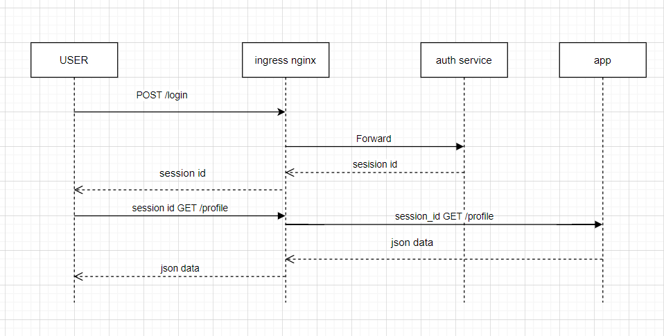

### k8s
hello-py in k8s

-  api gateway  like ingress nginx 

-  uses helm3  and helm-chart


### install

```cmd
namespace=default

helm install larisa ./hello-chart/

```

### architecture
Архитектура решения



### test
```
nginx forward auth

→ регистрация
  POST http://arch.homework/register [200 OK, 169B, 190ms]
  ✓  [INFO] Request: {
	"login": "Lysanne.Kohler", 
	"password": "upDn82NA0lyRxcx",
	"email": "Nyasia_Macejkovic@gmail.com",
	"first_name": "Alex",
	"last_name": "Douglas"
}

  ✓  [INFO] Response: {
  "id": 9
}


→ логин
  POST http://arch.homework/login [200 OK, 259B, 61ms]
  ✓  [INFO] Request: {"login": "Lysanne.Kohler", "password": "upDn82NA0lyRxcx"}
  ✓  [INFO] Response: {
  "status": "ok"
}


→ проверить данные о пользователе 
  GET http://arch.homework/auth [401 UNAUTHORIZED, 512B, 23ms]
  ✓  [INFO] Request: [object Object]
  ✓  [INFO] Response: <!DOCTYPE HTML PUBLIC "-//W3C//DTD HTML 3.2 Final//EN">
<title>401 Unauthorized</title>
<h1>Unauthorized</h1>
<p>The server could not verify that you are authorized to access the URL requested. You either supplied the wrong credentials (e.g. a bad password), or your browser doesn't understand how to supply the credentials required.</p>

  1. test token data

→ получить данные о пользователе
  GET http://arch.homework/users/me [200 OK, 297B, 29ms]
  ✓  [INFO] Request: [object Object]
  ✓  [INFO] Response: {
  "email": "Nyasia_Macejkovic@gmail.com", 
  "first_name": "Alex", 
  "id": "9", 
  "last_name": "Douglas", 
  "login": "Lysanne.Kohler"
}


→ обновление профиля
  PUT http://arch.homework/update_profile [200 OK, 412B, 56ms]
  ✓  [INFO] Request: {
	"first_name": "Ben"
}

  ✓  [INFO] Response: {
  "email": "Nyasia_Macejkovic@gmail.com", 
  "first_name": "Ben", 
  "id": "9", 
  "last_name": "Douglas", 
  "login": "Lysanne.Kohler"
}


→ проверить данные о пользователе  после обновления
  GET http://arch.homework/auth [200 OK, 412B, 22ms]
  ✓  [INFO] Request: [object Object]
  ✓  [INFO] Response: {
  "email": "Nyasia_Macejkovic@gmail.com", 
  "first_name": "Alex", 
  "id": 9, 
  "last_name": "Douglas", 
  "login": "Lysanne.Kohler"
}

  2. test token data

→ логаут
  GET http://arch.homework/logout [200 OK, 248B, 30ms]
  ✓  [INFO] Request: [object Object]
  ✓  [INFO] Response: {
  "status": "ok"
}


→ получить данные после разлогина
  GET http://arch.homework/users/me [200 OK, 220B, 51ms]
  ✓  [INFO] Request: [object Object]
  ✓  [INFO] Response: {
  "message": "Please go to login and provide Login/Password"
}


┌─────────────────────────┬───────────────────┬───────────────────┐
│                         │          executed │            failed │
├─────────────────────────┼───────────────────┼───────────────────┤
│              iterations │                 1 │                 0 │
├─────────────────────────┼───────────────────┼───────────────────┤
│                requests │                 8 │                 0 │
├─────────────────────────┼───────────────────┼───────────────────┤
│            test-scripts │                13 │                 0 │
├─────────────────────────┼───────────────────┼───────────────────┤
│      prerequest-scripts │                10 │                 0 │
├─────────────────────────┼───────────────────┼───────────────────┤
│              assertions │                18 │                 2 │
├─────────────────────────┴───────────────────┴───────────────────┤
│ total run duration: 1312ms                                      │
├─────────────────────────────────────────────────────────────────┤
│ total data received: 879B (approx)                              │
├─────────────────────────────────────────────────────────────────┤
│ average response time: 57ms [min: 22ms, max: 190ms, s.d.: 51ms] │
└─────────────────────────────────────────────────────────────────┘

```
