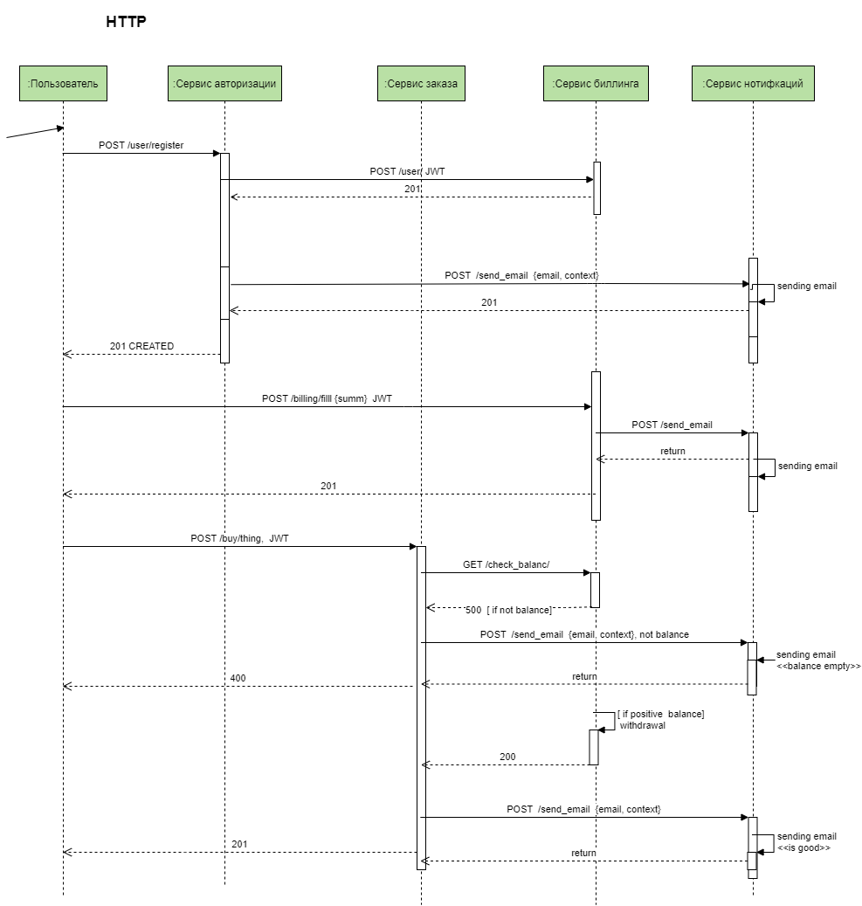
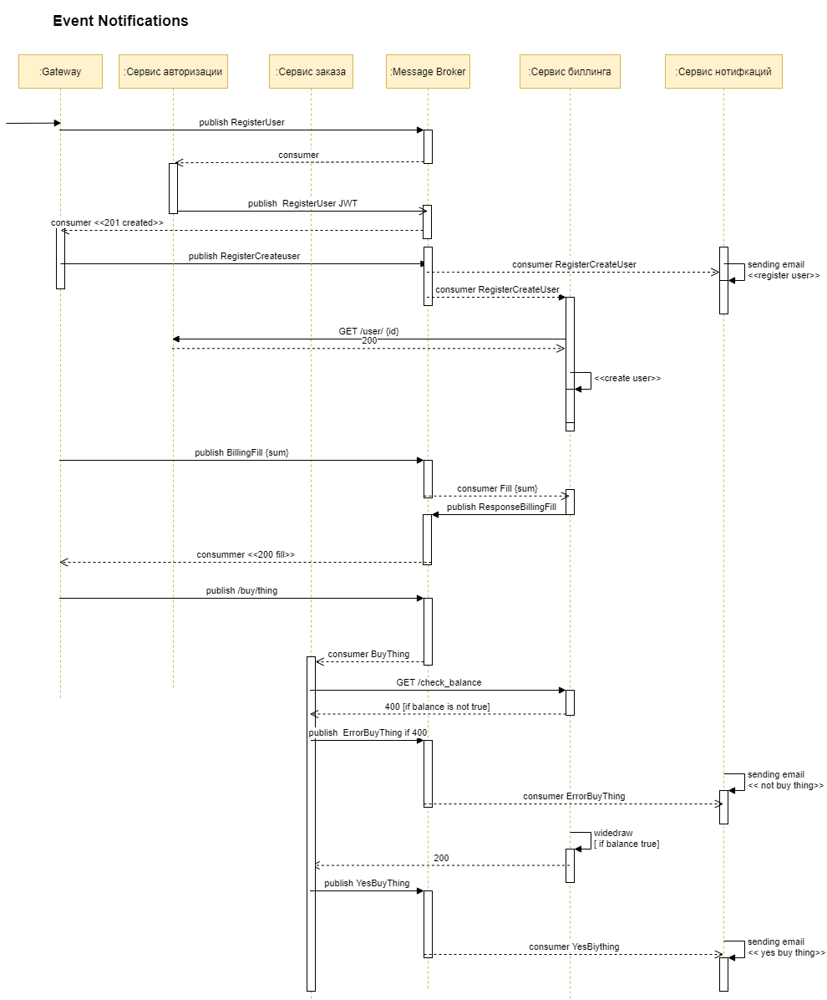
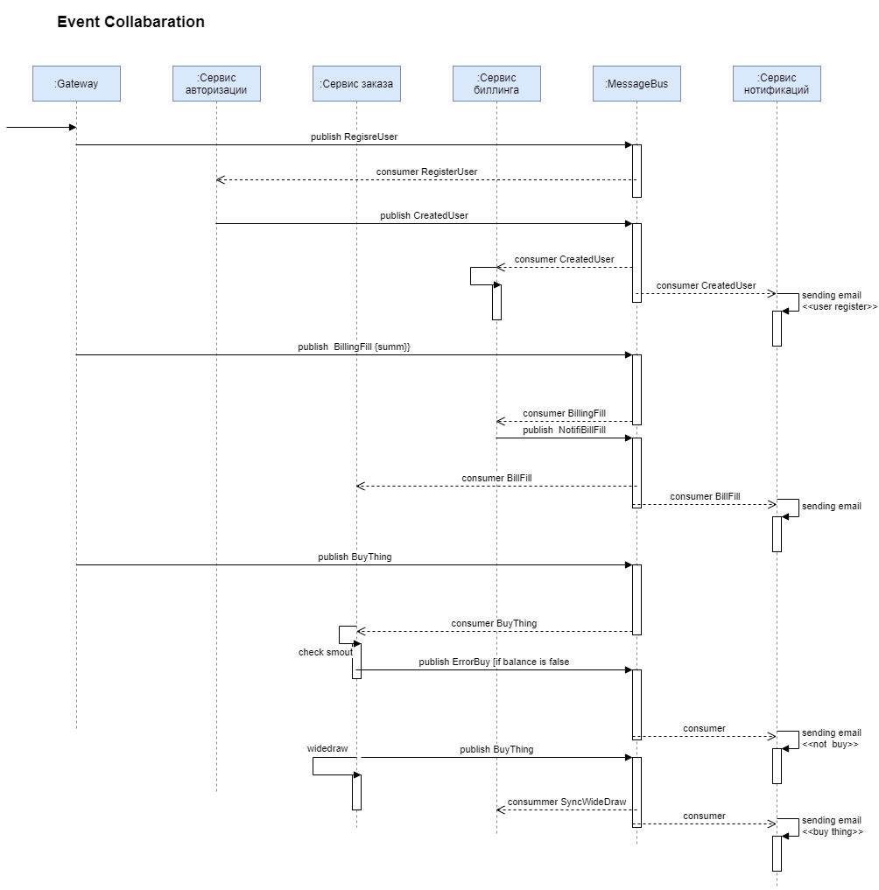

###  1 Подход HTTP  - взаимодействие

A lot of a get query )
Информация  о  пользоватле  хранится в JWT токене.

Минусы данного  подхода:

1. Synchronous Request/Reply
Регистрация   данного  пользователя,  сильно  нагружена. Перед  тем как отправтиь  response,  приходится  ждать пока  пользователь добавится в  сервис  биллинга, а затем, сервис нотификаций  отправим  уведомление на email. ( увеличивает  время  ответа  клиенту на  запрос регистрации пользователя).Здесь прям  само  напрашивается, вынести  действия, добавление пользователя в  серис билллинга и отправку  уведомлений, асинхронно.

2. При  хранении  информации,   о пользователе в JWT,  из  которого сервис биллинга  считывает, для  создания  пользователя   в своем  сервисе,  возникает  ситуация -  синхронизации пользоватлей.

3. Блокируется в ожидании ответа.

### 2 Подход Event Notifications

В payload событий передается только самые существенные данные (  идентификатор  пользователя,   индентификатор счета, товара...) 

Минусы  данного  подхода:

1Часть  действий ( создание пользователя,  отправка  нотификаци) ушли в асинхронность, за счет   появления  message bus, но   хождение на  за доп инфой   в сторонние  сервисы 
осталась, (лишнее   хождение по  http, не нужная  нагрузка  на  чтение  из сервиса  биллинга и    сервиса  авторизации (хранищий  инфу о пользоватле) )
2 Error Handling.

### 3 Подход EventCollaboration

Необходиму   информацию  храним в payload сообщениях. Loose Coupling ) - подписались, получили.

Минусы данного подхода:

Поддержа в консистентном состоянии локальной копии данных

Вывод:

Подход  с event collaboration, весьма заманчив  и избавляет от  множества проблем c restfull: handle error, latancy, и  закрыв  глаза  на слежение  за   консистентностью данных, но  для   малого  проекта, я бы  все  все же выбарала
совмещенный  подход Event Notifications и Restfull. Оставила  хранение  информации о пользователе в JWT,   для  минимизации лишних  get запросов (  рамках данной задачи), 
"простое лучше сложного) ". 

Вот такое  схематичское апи https://documenter.getpostman.com/view/7669157/TVRhbp4Y

