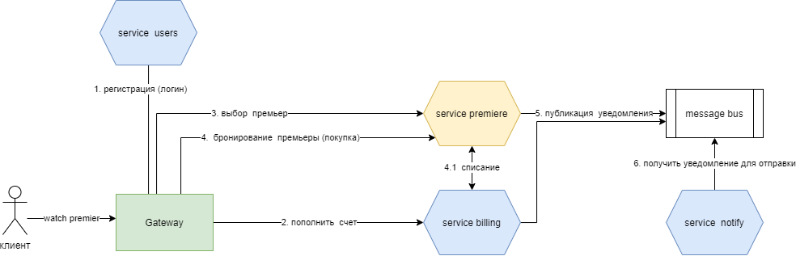

### Интернет  магазин шанс-видео.

Суть, есть  интернет магазн, шанс-видео, похоже что-то поход в театр  на  примьеру, но  онлайн.

### Пользовательский  сценарий:
_____

**Есть** авторизованный  клиент

**И есть** интернет мазазин  "шанс-видео"

**И** клиент вводит в строке  поиска "Маузер"

**Тогда** появляется  список премьер, подходящий под   запрос  пользователя

**И** в  карточке  товара пользователь  видит:

- название  премьеры
- актеры
- описание
- цена  просмотра в театре
- цена просмотра онлайн
- скидка
- время  резервации
_____
**Когда** клиент нажимает на  карточку  товара

**Тогла** клиент переходит на страницу  с описание  премьеры
____
**Когда** клиент нажимает на добавить в  корзину

**Тогда** примьера добавляется в  корзину
____
**Когда** клиент переходит в  корзину

**Тогда** он  видит список всех своих пермьер
____
**Когда** клиент  нажимает кнопку Оформить  заказ

**Тогда** появляется   форма  формления  заказа, где он может  выбрат  время  резервации и срок
____
**Когда** клиент ввел данные  о сроке и времени резервации

**Тогда** появляется  форма  подтверждения списания   средств  со счета

**Или** появляется  форма  пополнения  баланса
_____
**Когда** пользователь подтвердил списание средств  со счета пользователя

**Тогда** примьера  доступна для  просмотра в личном   кабине, в  разделе мои премьеры

**И** приходит  письмо об  успешном приобретении  премьеры  и  описанем срока действаия
_____
**Когда**срок резервации подходит к  концу срока

**Тогда** приходит  письмо-напоминание о  завершении срока резервации
____

###  Общая схема взаимодействия сервисов

### Описание  сервисов
____
#### Сервис примьер ( посути   наверное   сервис заказа)

**Название**
премьеры

**Запросы**

- поиск премьеры
  GET /api/v1/search/?q=Маузер
- получить стоимость  аренды  премьеры
  GET /api/v1/rent/:id=&period=
  - информация  о  премьере
  GET /api/v1/premiere/:id
 
**Команды**

- добавить преьеру в личный кабинет после успешной  оплаты
  POST /api/v1/rent/  {id: 'идентификатор премьеры', 'period': 12}

**Зависимости**

- 

**Вопросы**

- Что  использовать для поиска премьер (Elastic or  Shinx)? 
- Как   будет  храниться история  премьер,  использовать для   это какую  либо timseriesdb

______
##### Сервис биллинга

**Название**
биллинг

**Запросы**
- просмотр счета
  GET /api/v1/billing/amount/
- пополнить счет
  POST /api/v1/billing/fill {summ: сумма  пополнения}
  
**Зависимости**

- 

**Команды**

- списание  средств
  POST /api/v1/billing/withdraw/ {id: идентификатор премьеры,  summ: сумма  списания}

 
**Вопросы**

- Как  хранить историю списания?
- Предусмотруть  возможность отмены резервации, как вернуть  средства на счет?
- Что если клиент решит  изменить срок резервации?

_____

#### Сервис уведомлений

**Название**
уведомление  клиентов об успешном  ( или нет ) выполнении  операций 

**Запросы**

- 

**Зависимозсти**

-  слушает  очередь  SendNotify, для  отправки уведомлений

**Команды**

- 

**Вопросы**

- Что  если  изменится способ уведомлений, если  к примеру  необходимо уведомлять  пользователя не  по почте, а по cms?

